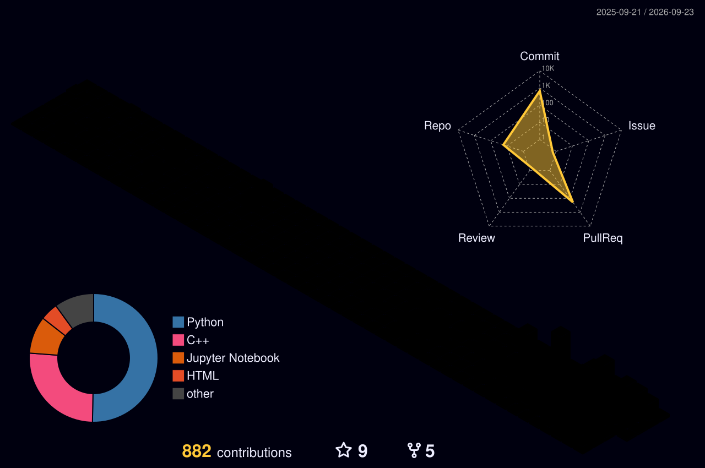

<h3>안녕하세요 게임서버, 웹 개발자 김경민입니다 
</h3>

## 🛠 Tech Stack

| Category | Technologies |
|:---|:---|
| **Languages** |    |
| **Database** |   |
| **Framework** |  |
| **Server & Graphics** |   |
| **Tools** |      |

<table>
  <tr>
    <td>
      
    </td>
    <td>
      
       
      
    </td>
  </tr>
</table>
<!--
**kimgyeongmin5348/kimgyeongmin5348** is a ✨ _special_ ✨ repository because its `README.md` (this file) appears on your GitHub profile.

Here are some ideas to get you started:

- 🔭 I’m currently working on ...
- 🌱 I’m currently learning ...
- 👯 I’m looking to collaborate on ...
- 🤔 I’m looking for help with ...
- 💬 Ask me about ...
- 📫 How to reach me: ...
- 😄 Pronouns: ...
- ⚡ Fun fact: ...
-->
